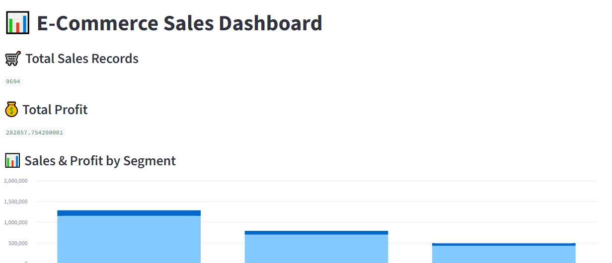
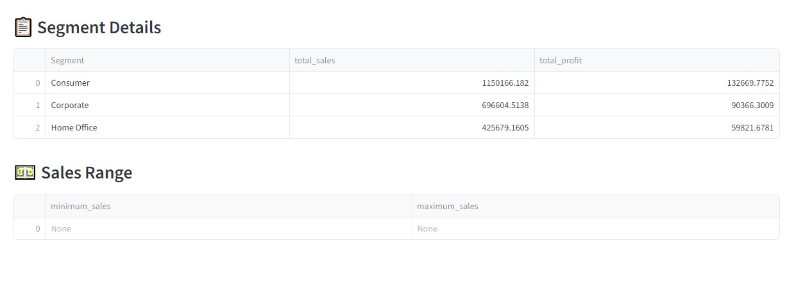

## E-commerce Sales Analytics

## An end-to-end E-commerce Sales Analytics project that analyzes sales data using Python, Pandas, MySQL, and Streamlit to extract meaningful business insights and build an interactive dashboard.

📌 Project Overview

# This project focuses on analyzing e-commerce sales data to understand:

> Overall sales and profit performance
> Customer and order trends
> Sales by different customer segments
> Minimum and maximum sales
> Business performance through visualizations

## WORKFLOW

Raw Data in CSV → Data Cleaning → MySQL Database → SQL Analysis → Dashboard

🛠️ Tech Stack
1. Python
2. Pandas – Data cleaning and analysis
3. Numpy-Numerical manipulation 
4. Matplotlib – Data visualization
5. MySQL – Data storage and SQL analysis
6. Streamlit – Interactive dashboard

#📂 Project Structure

E-commerce-sales-analysis/
|
├── data/
│   └── sales.csv
│
├──|notebooks/
|   └── EDA.ipynb
│
├── .env
├── .gitignore
├── database.py
├── ex.py
└── README.md
└── |dashboard/
  └──dashboard.png
------------------------------------------------  
    
🔄 Project Workflow
 1. Data Collection

This project uses an e-commerce sales dataset containing information related to orders, customers, sales, profit, segments, and other attributes.

2. Data Cleaning

 The dataset was cleaned using Pandas by:

>Handling missing values
>Removing duplicate records
>Checking data types
>Cleaning column names
>Preparing the dataset for database analysis

3. Database Management

The cleaned dataset was imported into MySQL.

A database was created for storing and querying the sales data.

Example:

CREATE DATABASE ecommerce_db;

The cleaned sales data was then stored in a MySQL table.

 4. SQL Analysis

SQL was used to perform different analytical operations such as:

>Aggregations
>GROUP BY
>Filtering
>Sorting
>Customer analysis
>Sales and profit analysis
>Segment-wise analysis

 5. Dashboard

## A Streamlit dashboard was created to display important KPIs and visualizations.

The dashboard includes:

💰 Total Sales
📈 Total Profit
🛍️ Total Orders
👥 Customer-related insights
📊 Segment-wise sales
📉 Minimum and maximum sales
📊 Dashboard

>>The project includes an interactive dashboard built using Streamlit.

## DASHBOARD PREVIEW

# 🎯 Project Goal

The main goal of this project is to practice an end-to-end Data Analytics workflow, starting from raw data and transforming it into useful insights through data cleaning, SQL analysis, visualization, and dashboarding.

#👩‍💻 Author

Ishika Raghav

CSE – Artificial Intelligence & Machine Learning

Interested in Data Analytics, SQL, Python, Power BI, and Machine Learning.

